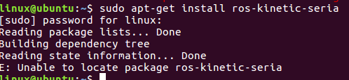

# ROS序列埠範例

原始碼:可直接下載 .zip 檔

介紹如何在ROS下來讀取HI226/HI229的數據，並提供了c++語言範例代碼，通過執行ROS命令，運行相應的節點，就可以看到打印到終端上的資訊。

* 測試環境：Ubuntu16.04   

* ROS版本：ROS Kinetic Kame

* 測試設備：HI226 HI229

## 1. 安裝USB-UART驅動

Ubuntu 系統自帶CP210x的驅動，默認不需要安裝序列埠驅動。將調試版連接到電腦上時，會自動識別設備。識別成功後，會在dev目錄下出現一個對應的設備:ttyUSBx

檢查USB-UART設備是否被Ubantu識別：

1. 打開終端，輸入`ls /dev`,先查看已經存在的序列埠設備。
2. 查看是否已經存在 ttyUSBx 這個設備文件，便於確認對應的端口號。x表示USB設備號，由於Ubuntu USB設備號為從零開始依次累加，所以多個設備每次開機後設備號是不固定的，需要確定設備的設備號。
4. 接下來插入USB線，連接調試板，然後再次執行`ls /dev`。 dev目錄下多了一個設備, 如圖：


**ttyUSB0** 文件就是調試版在ubuntu系統中生成的設備(後面的數字是不固定的，有可能為 ttyUSB1  或 ttyUSB2)

5. 打開USB設備的可執行權限：
```shell
   $ sudo chmod 777 /dev/ttyUSB0
```
## 2. 安裝ROS serial軟體包

本範例依賴ROS提供的serial包實現序列埠通信.

1. 首先執行如下命令，下載安裝serial軟體包：

```shell
$ sudo apt-get install ros-kinetic-serial
```

2. 然後輸入`roscd serial`命令，進入serial下載位置，如果安裝成功，就會出現如下資訊：

```shell
$:/opt/ros/kinetic/share/serial
```

​	3.如果出現裝不上，可以到本文檔的最後查看本人遇到的問題和解決方式。

## 3. 編譯serial_imu_ws工作空間

1. 打開終端進入/examples/ROS/serial_imu_ws 目錄

2. 執行`catkin_make`命令，編譯成功後出現完成度100%的資訊。

## 4. 修改序列埠鮑率和設備號

1. 在Ubuntu環境中，支援的鮑率為115200, 460800, 921600。本範例使用的默認鮑率是115200，默認打開的序列埠名稱是/dev/ttyUSB0。	

2. 如果您需要更高的輸出頻率，請編輯serial_imu.cpp文件，修改serial_imu.cpp文件中的宏定義，改為其他鮑率。	
```c
#define IMU_SERIAL ("/dev/ttyUSB0")
#define BAUD       (115200)
```

注意修改後需要回到serial_imu_ws目錄下，重新執行`catkin_make`命令

## 5. 顯示數據
本範例提供了三種查看數據方式：

1. 顯示所有的數據資訊，便於查看數據。
2. 打印ROS標準imu_msg 數據
3. rviz工具實現可視化

### 	5.1：輸出IMU原始數據

1.打開另一個終端，執行：

```shell
$ roslaunch imu_launch imu_msg.launch imu_package:=0x91
```
2. 如果執行失敗，提示找不到相應的launch文件，則需要配置環境，在當前終端執行：

```shell
$source <serial_imu_ws_dir>/devel/setup.bash
```

3. 執行成功後，就可以看到所有的資訊：

```txt

     Devie ID:     0
    Run times: 0 days  3:26:10:468
  Frame Rate:   100Hz
       Acc(G):   0.933    0.317    0.248
   Gyr(deg/s):   -0.02     0.30    -0.00
      Mag(uT):    0.00     0.00     0.00
   Eul(R P Y):   52.01   -66.63   -60.77
Quat(W X Y Z):   0.770    0.066   -0.611   -0.172

```


### 	5.2：輸出ROS標準 Imu.msg

1. 在windows系統下進行配置模組，使能四元數輸出。
2. 使用Window下 Uranus上位機進行配置：先把模組連接到PC機上。然後使用Uranus工具進行 連接對應的com口，點擊 __工具__  --->  __配置模組__，在協議配置區域，可以選擇老協議中單獨勾選 __加速度__ 、__角速度__ 、 __四元數__ ，或者是選擇新協議的 __IMU數據集合__(0x91) 。勾選好之後，點擊 __寫入配置__ ，接收區最後顯示 __ok__ ，說明配置成功。在關閉配置窗口上，看一下數據顯示區域，最後確認一下，加速度、角速度、四元數是否正確輸出。執行`roslaunch imu_launch imu_msg.launch`命令。執行成功後，就可以看到ROS定義的IMU訊息：
```txt
header: 
  seq: 595
  stamp: 
    secs: 1595829903
    nsecs: 680423746
  frame_id: "base_link"
orientation: 
  x: 0.0663746222854
  y: -0.611194491386
  z: -0.17232863605
  w: 0.769635260105
orientation_covariance: [0.0, 0.0, 0.0, 0.0, 0.0, 0.0, 0.0, 0.0, 0.0]
angular_velocity: 
  x: 0.0851199477911
  y: 0.0470183677971
  z: 0.00235567195341
angular_velocity_covariance: [0.0, 0.0, 0.0, 0.0, 0.0, 0.0, 0.0, 0.0, 0.0]
linear_acceleration: 
  x: 0.93323135376
  y: 0.317857563496
  z: 0.247811317444
linear_acceleration_covariance: [0.0, 0.0, 0.0, 0.0, 0.0, 0.0, 0.0, 0.0, 0.0]

```

### 	5.3：rviz可視化

1. 安裝ROS rviz插件
2. 同上節，使模組能輸出四元數
3. 進入serial_imu_ws，執行`roslaunch imu_launch imu_rviz.launch`命令，執行成功後，rviz工具被打開。
4. 先點擊左下角的Add標籤，然後在彈出窗口中，選擇 By display type標籤，查找rviz_imu_plugin；找到之後，選擇它下面的imu標籤，點擊OK, 這時，我們可以看到rviz的左側的展示窗口中已經成功添加上了Imu的標籤。在FixedFrame中填入**base_link** 。topic中添加 **/IMU_data**。這時，可以看到坐標系隨感測器改變而改變。
5. ​	可以從這裡下載rviz的工具,這是ROS官方的一個rviz插件：

```shell
git clone -b indigo https://github.com/ccny-ros-pkg/imu_tools.git
```


## 6. FAQ
​	1.如果是第一次裝ROS serial包，有很大的可能會失敗，因為我們在裝的時候，遇到了這個問題，這裡把解決方法提供出來，節約大家的時間。

當在終端執行`sudo apt-get install ros-kinetic-serial`這條命令的時候，有可能會提示你



為了提供素材，serial故意輸錯的。

一個解決辦法是：

```shell
$cd /etc/apt/sources.list.d
$sudo vi ros-latest.list
```

打開這個文件之後，一般這個文件中只有一個可用的源，就是指沒有被註釋的，現在把它註釋掉，在它的開頭輸入__#__即可註釋。

然後另起一行輸入： deb https://mirrors.tuna.tsinghua.edu.cn/ros/ubuntu/ xenial main

然後保存，關閉文件。打開終端，執行`sudo apt-get update`,然後執行`sduo apt-get install ros-kinetic-serial`.
