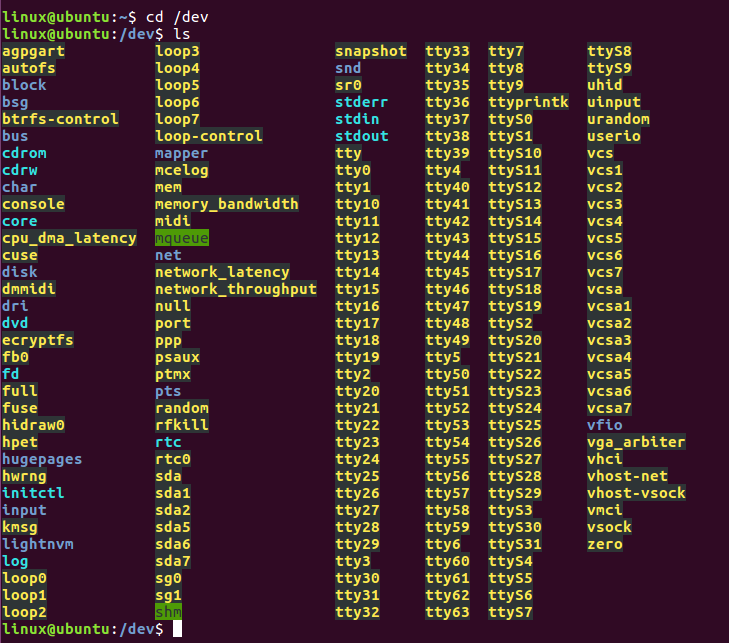

# 	Ubuntu範例

​	本文檔介紹了如何在Ubuntu環境中讀取Hi229/226 的數據，本路徑提供了c語言範例代碼，生成的可執行文件用於讀取模組的數據。

​	測試環境： Ubuntu 16.04

​	測試設備：超核調試版 	HI226	HI229

## 查找USB-UART設備

​	因為Ubuntu 系統自帶CP210x的驅動，所以不用專門去安裝相應序列埠驅動。將調試版連接到電腦上時，會自動識別設備。識別成功後，會在dev目錄下出現一個對應的設備文件。

​	檢查系統是否識別到USB-UART設備：

​	1、打開Ubuntu系統，按下 __ctrl + alt + t__ 打開命令行窗口

​	2、在窗口上輸入 `cd /dev`  切換到dev目錄下，這個目錄下，是一些設備文件。

​	3、然後在dev目錄下執行`ls` 這個命令是查看當前目錄下都有哪些文件，然後按下 Enter 鍵，就會出現設備文件名稱，在這些文件名稱中，主要關心 **ttyUSB** 這個設備文件。後面數字代表USB設備號，由於Ubuntu USB設備號為從零開始依次累加，所以多個設備每次開機後設備號是不固定的，需要確定設備的設備號。下面用兩張圖片來描述:

​	上圖為沒有插入USB設備的情況，這個時候，dev目錄下並沒有名為 __ttyUSB__ 文件，插入USB線，連接調試板，然後再次執行`ls`：

dev目錄下多了幾個文件名稱, 如圖：

​	**ttyUSB0** 文件就是調試版在ubuntu系統中生成的設備文件，對它進行讀寫，就可以完成序列埠通信。這個文件名稱我們把它記下來。後面的數字是不固定的，有可能為 **ttyUSB1**  或 **ttyUSB2** 等。

## 波特率設置

​	在Ubuntu環境中，波特率支援到115200,460800,921600，本範例使用的是115200。

​		如果需要輸出幀率超過100Hz，則需要需要修改main.c文件中的options.c_cflag參數，改為更高的波特率。

​		如圖，在第83行，將B115200修改為B460800或者是B921600。

## 編譯並執行

​	我們開始在Ubuntu環境下生成一個可執行文件，專門用來解析模組的數據：

​	首先在Ubuntu系統中，按下 __ctrl + alt + t__ 快捷鍵，在彈出的窗口上，執行`mkdir hipnuc` 建立hipunc目錄,然後將本文檔所在目錄下的所有文件複製到 __hipnuc__ 目錄下。

​	執行`make`, 生成可自行文件`main`。 並執行`sudo ./main ttyUSB0`:

​	執行成功後，會出現這個畫面：

​	這個畫面上的數字會隨著模組位置的改變而發生變化。

​	如果後期修改了這些文件，需要執行`make clean`命令，進行清理之前生成的舊 __.o__ 和 __main__ 文件，然後再執行`make`，重新生成 __main__ 這個可執行文件。

​	如果後期您需要在本路徑上添加其他文件，配合使用，請打開 __Makefile__ 文件，在第一行的後面加上後添加文件的鏈接文件名，例如添加append_file.c文件，那麼在 __Makefile__ 中第一行後面追加append_file.o文件名。如果後加的文件還需要鏈接第三方的庫，請在第二行的後面添加庫名字。格式為 __-l+lib_name__  ("l" 是「L"的小寫的英文字母)。

​	如果出現：

​	表示未能找到序列埠，需要回到**《查找USB-UART設備》一節** 確認USB-UART設備已經被ubuntu識別。

